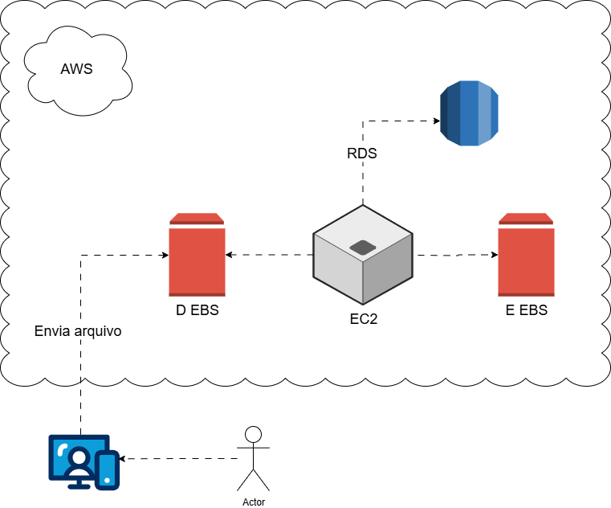
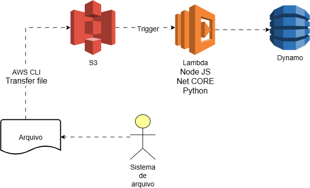

# ☁️ Gerenciamento de Instâncias EC2 na AWS  

O **Amazon EC2 (Elastic Compute Cloud)** é o serviço da AWS que permite criar e gerenciar servidores virtuais na nuvem.  
Essas instâncias podem ser configuradas de acordo com a necessidade da aplicação, oferecendo flexibilidade em capacidade de processamento, armazenamento e rede.  

Este guia documenta conceitos de **EC2, EBS, RDS** e também o uso de **S3 com Lambda e DynamoDB**.  

---

## 🚀 Amazon EC2 com EBS e RDS  
O **EC2** é a base da infraestrutura em nuvem da AWS. Ele permite criar servidores virtuais, anexar volumes EBS para armazenamento e integrar bancos de dados relacionais via RDS.  

📌 Arquitetura de exemplo:  

  

### 🔑 Destaques  
- **EC2**: Criação, configuração e encerramento de instâncias.  
- **EBS**: Volumes em blocos que funcionam como discos virtuais, podendo ser anexados a qualquer instância.  
- **RDS**: Banco de dados gerenciado para simplificar operações e aumentar a disponibilidade.  

---

## 📦 Fluxo de Dados com S3, Lambda e DynamoDB  
Outra arquitetura bastante usada na AWS envolve **serviços serverless** e armazenamento em objetos.  

📌 Fluxo:  
1. Um arquivo é transferido para o **S3**.  
2. Um **Lambda** (Node.js, Python, .NET Core) é disparado automaticamente.  
3. O processamento grava os dados no **DynamoDB**.  

📌 Arquitetura de exemplo:  

  

---

## 💾 Amazon EBS – Elastic Block Store  
O **EBS** é o serviço de armazenamento em blocos para EC2:  
- Funciona como um disco rígido virtual.  
- Pode ser expandido sem interromper o serviço.  
- Alta durabilidade, com replicação automática.  

### 📊 Tipos de Volumes EBS  
- **gp3/gp2 (SSD de uso geral)**: equilíbrio entre custo e desempenho.  
- **io2/io1 (Provisioned IOPS SSD)**: alta performance para bancos de dados críticos.  
- **st1 (Throughput Optimized HDD)**: ideal para big data.  
- **sc1 (Cold HDD)**: baixo custo para dados raramente acessados.  

---

## 🔄 Boas Práticas de Gerenciamento  
- **Monitoramento** com CloudWatch.  
- **Segurança** com Security Groups e IAM Roles.  
- **Backups** com snapshots de volumes EBS.  
- **Escalabilidade** com Auto Scaling Groups + ELB.  

---

## 📚 Recursos Recomendados  
- [Documentação Amazon EC2](https://docs.aws.amazon.com/ec2/)  
- [Documentação Amazon EBS](https://docs.aws.amazon.com/ebs/)  
- [Documentação Amazon S3](https://docs.aws.amazon.com/s3/)  
- [AWS Toolkit for Visual Studio](https://docs.aws.amazon.com/toolkit-for-visual-studio/latest/user-guide/)  

---

## ✅ Conclusão  
O gerenciamento de instâncias **EC2** aliado ao armazenamento **EBS** e a integração com **RDS** forma a base para arquiteturas tradicionais na AWS.  
Quando combinado com **S3, Lambda e DynamoDB**, abre-se espaço para soluções **serverless**, escaláveis e altamente disponíveis.  

Dominar esses conceitos é essencial para qualquer profissional que deseja atuar com **Cloud Computing**.  

---

### 📌 Estrutura do Repositório  
```
 📂 images
 ┃ ┣ EC2-EBS-RDS.png
 ┃ ┗ S3-Lambda-DynamoDB.png
 📜 README.md
```
